# Pembuatan dan Pemasangan Self-Signed Certificate untuk IIS di Windows

Dokumentasi ini menyediakan panduan komprehensif langkah demi langkah untuk mengecek identitas server, membuat sertifikat SSL/TLS *self-signed* kustom menggunakan PowerShell, memasangnya pada Internet Information Services (IIS), serta mendistribusikan sertifikat publik ke komputer *client* agar koneksi HTTPS aman dan tepercaya di lingkungan lokal/internal.

---

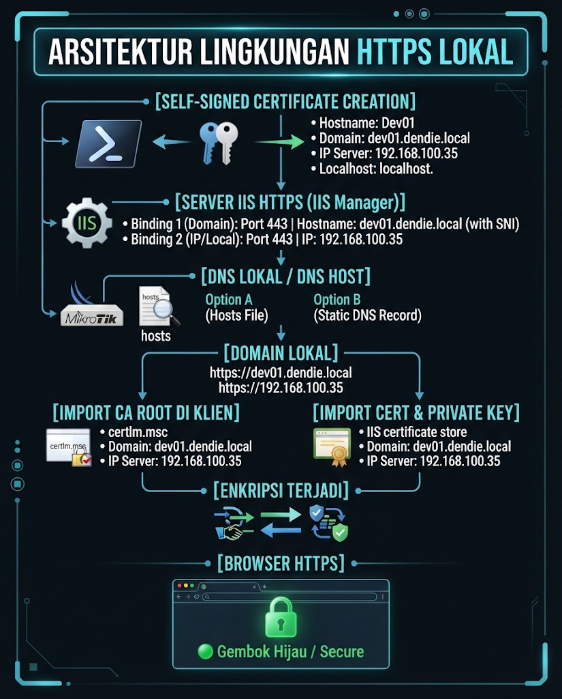


- [Pembuatan dan Pemasangan Self-Signed Certificate untuk IIS di Windows](#pembuatan-dan-pemasangan-self-signed-certificate-untuk-iis-di-windows)
  - [1. Cek Identitas Server (Nama, FQDN, \& IP)](#1-cek-identitas-server-nama-fqdn--ip)
    - [A. Cek Nama Komputer (Computer Name)](#a-cek-nama-komputer-computer-name)
    - [B. Cek FQDN (Fully Qualified Domain Name)](#b-cek-fqdn-fully-qualified-domain-name)
    - [C. Cek Alamat IP Server (IP Address)](#c-cek-alamat-ip-server-ip-address)
  - [2. Membuat Sertifikat Self-Signed via PowerShell](#2-membuat-sertifikat-self-signed-via-powershell)
  - [3. Memasang Sertifikat di IIS (Bindings)](#3-memasang-sertifikat-di-iis-bindings)
  - [4. Mengekspor Sertifikat Publik (Tanpa Private Key)](#4-mengekspor-sertifikat-publik-tanpa-private-key)
  - [5. Mengimpor Sertifikat ke Komputer Client](#5-mengimpor-sertifikat-ke-komputer-client)
  - [6. Konfigurasi DNS Lokal \& Jaringan (Agar Domain Mudah Diakses)](#6-konfigurasi-dns-lokal--jaringan-agar-domain-mudah-diakses)
    - [6.1 Cara 1: Membuat DNS Lokal Menggunakan Mapping File Hosts (Tanpa Server DNS Fisik)](#61-cara-1-membuat-dns-lokal-menggunakan-mapping-file-hosts-tanpa-server-dns-fisik)
    - [6.2 Cara 2: Penjelasan Server DNS Lokal (Jika Menggunakan Infrastruktur Terpusat)](#62-cara-2-penjelasan-server-dns-lokal-jika-menggunakan-infrastruktur-terpusat)
    - [6.3 Cara 3: Setting Client di Network (Pengaturan DNS Client)](#63-cara-3-setting-client-di-network-pengaturan-dns-client)
  - [Sebagai contoh server DNS yg berada di IP 192.168.100.1](#sebagai-contoh-server-dns-yg-berada-di-ip-1921681001)
    - [6.4 Cara 4: Setting Network di Gateway (Router / Firewall)](#64-cara-4-setting-network-di-gateway-router--firewall)
  - [7 Membuat SSL type PFX untuk IIS Certificate](#7-membuat-ssl-type-pfx-untuk-iis-certificate)
    - [7.1 Langkah Mengekspor Sertifikat ke Format .PFX (Beserta Private Key)](#71-langkah-mengekspor-sertifikat-ke-format-pfx-beserta-private-key)

---

## 1. Cek Identitas Server (Nama, FQDN, & IP)

Sebelum membuat sertifikat, pastikan Anda mengetahui identitas server dengan benar agar parameter `-DnsName` nantinya sesuai dengan alamat akses. Buka **PowerShell** sebagai Administrator, lalu jalankan perintah berikut:

### A. Cek Nama Komputer (Computer Name)
```powershell
hostname
```
*(Atau menggunakan variabel `$env:COMPUTERNAME`).*


### B. Cek FQDN (Fully Qualified Domain Name)
Jika server Anda terdaftar dalam jaringan domain Windows (Active Directory):
```powershell
[System.Net.Dns]::GetHostByName(($env:computerName)).HostName
```

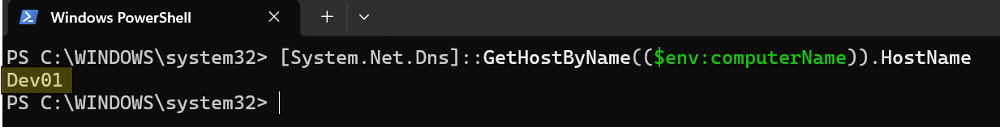

### C. Cek Alamat IP Server (IP Address)
Melihat daftar alamat IP aktif pada antarmuka jaringan lokal server:
```powershell
Get-NetIPAddress -AddressFamily IPv4 | Where-Object {$_.InterfaceAlias -notlike "*Loopback*"} | Select-Object IPAddress, InterfaceAlias
```
*(Catat nilai `IPAddress` yang didapat, misal: `192.168.100.35`, untuk dimasukkan ke dalam parameter pembuatan sertifikat).*

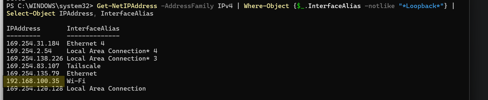

---

## 2. Membuat Sertifikat Self-Signed via PowerShell

Buka **PowerShell** dengan hak akses Administrator (`Run as Administrator`), lalu jalankan perintah berikut. Sesuaikan nilai `-DnsName` dengan hasil pengecekan identitas server di Langkah 1 (nama host, FQDN, localhost, dan IP statis).

```powershell
New-SelfSignedCertificate `
    -DnsName "Dev01", "dev01.dendie.local", "localhost", "192.168.100.35" `
    -CertStoreLocation "Cert:\LocalMachine\My" `
    -FriendlyName "Web-SSL-Cert" `
    -KeyExportPolicy Exportable `
    -NotAfter (Get-Date).AddYears(2)
```

* **Penjelasan Parameter Penting:**
  * `-DnsName`: Menampung daftar nama host, FQDN, domain lokal, atau IP statis server agar tidak terjadi error *name mismatch* saat diakses dari komputer lain.
  * `-CertStoreLocation "Cert:\LocalMachine\My"`: Menyimpan sertifikat secara otomatis ke *Certificate Store* tingkat lokal komputer (bukan *User Store*).
  * `-KeyExportPolicy Exportable`: Mengizinkan sertifikat beserta *private key*-nya untuk diekspor kembali jika diperlukan salinan cadangan (*backup*).

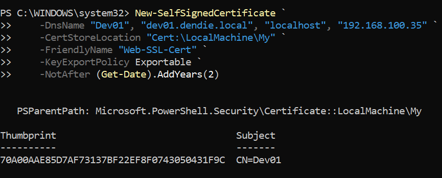

---

## 3. Memasang Sertifikat di IIS (Bindings)

Setelah sertifikat berhasil dibuat di sistem Windows, pasang sertifikat tersebut ke situs web Anda di IIS:

1. Buka **IIS Manager** (`inetmgr`) dari menu Start Windows.
2. Pada panel sebelah kiri (*Connections*), pilih nama server Anda, lalu kembangkan folder **Sites**.
3. Klik pada nama website target Anda (misalnya *AppMain*).
4. Pada panel sebelah kanan (*Actions*), klik menu **Bindings...**.
5. Pada jendela *Site Bindings*, klik **Add...** (jika belum ada port 443) atau pilih baris protokol **https** lalu klik **Edit...**.
6. Pada bagian **SSL certificate**, cari dan pilih sertifikat yang memiliki *Friendly Name* **"Web-SSL-Cert"**.
7. Klik **OK** lalu klik **Close**.

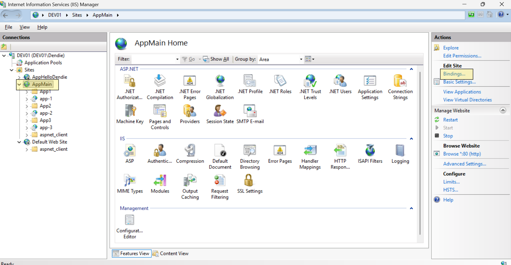

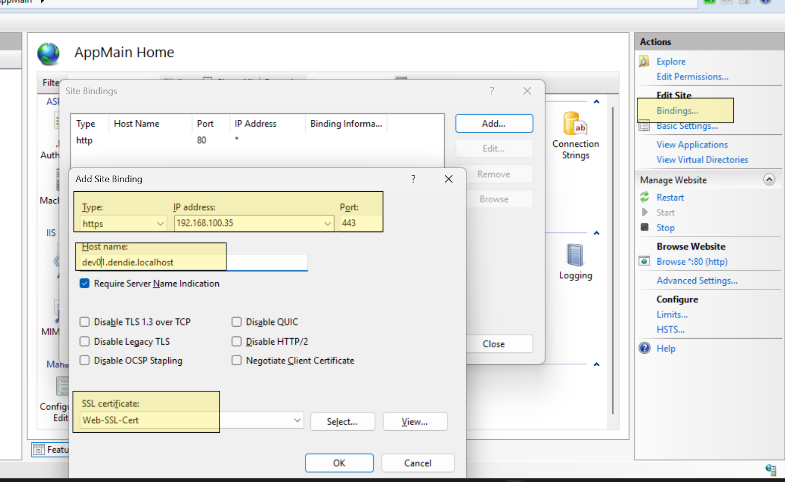

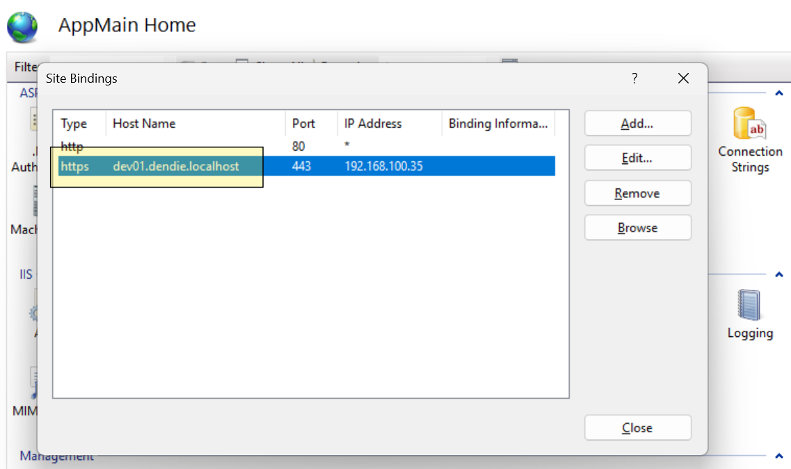

---

## 4. Mengekspor Sertifikat Publik (Tanpa Private Key)

Agar komputer *client* di dalam jaringan lokal mempercayai sertifikat *self-signed* ini, Anda harus mengekspor sertifikat publiknya saja (tanpa menyertakan kunci privat demi keamanan):

1. Tekan tombol `Windows + R`, ketik **`certlm.msc`** (Certificates - Local Computer), lalu tekan *Enter*.
2. Arahkan direktori di sebelah kiri ke folder **Personal** > **Certificates**.
3. Cari sertifikat Anda (misalnya berdasarkan *Friendly Name* `Web-SSL-Cert`), klik kanan pada sertifikat tersebut, pilih **All Tasks** > **Export...**.
4. Pada jendela *Certificate Export Wizard*:
   * Klik **Next**.
   * Pilih opsi **No, do not export the private key** (Sangat penting!), lalu klik **Next**.
   * Pilih format **DER encoded binary X.509 (.cer)**, lalu klik **Next**.
   * Tentukan lokasi penyimpanan dan nama file (misal: `C:\Certs\web-server.cer`), klik **Next** lalu **Finish**.


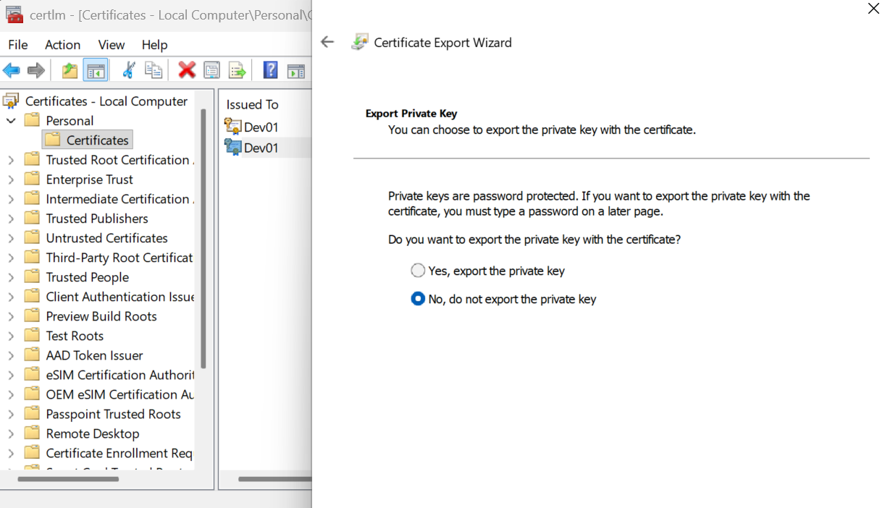

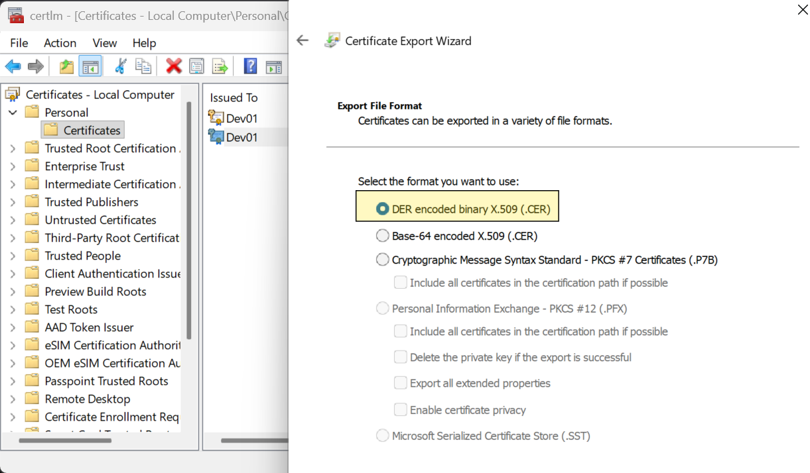

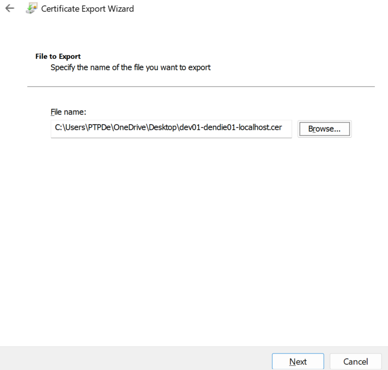

---

## 5. Mengimpor Sertifikat ke Komputer Client

Pindahkan file `.cer` hasil ekspor dari server ke komputer *client* (pengguna), lalu lakukan langkah berikut agar *browser* tidak menampilkan peringatan keamanan (*Not Secure* / *NET::ERR_CERT_AUTHORITY_INVALID*):

1. Di komputer *client*, tekan tombol `Windows + R`, ketik **`certlm.msc`**, lalu tekan *Enter*.
2. Arahkan folder di sebelah kiri ke **Trusted Root Certification Authorities** > **Certificates**.
3. Klik kanan pada folder **Certificates**, arahkan ke **All Tasks** > **Import...**.
4. Pada jendela *Certificate Import Wizard*, cari file `.cer` yang telah dipindahkan tadi, lalu klik **Next**.
5. Pastikan penyimpanan otomatis masuk ke kategori *Trusted Root Certification Authorities*, lalu klik **Next** dan **Finish**.
6. Segarkan (*refresh*) atau buka ulang *browser* Anda; kini akses ke website via protokol `https://...` pada jaringan lokal akan tepercaya sepenuhnya.

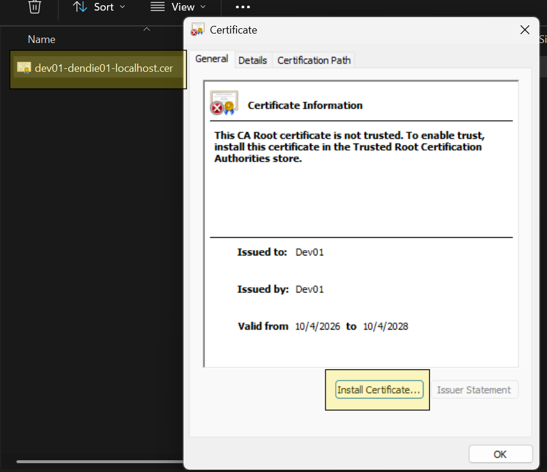

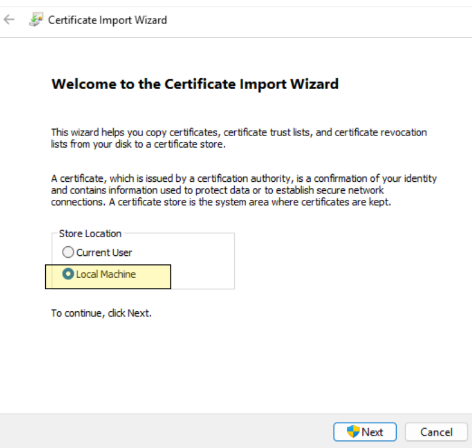

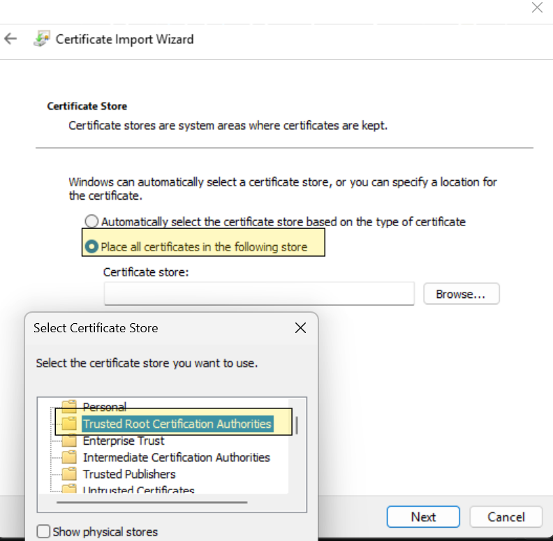

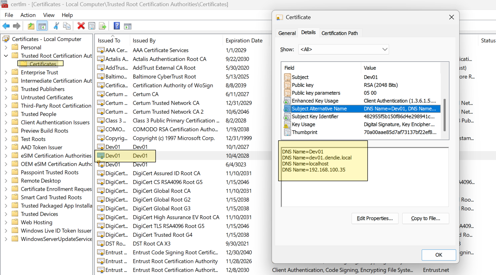

## 6. Konfigurasi DNS Lokal & Jaringan (Agar Domain Mudah Diakses)

Agar domain lokal seperti `dev01.dendie.local` dapat dikenali oleh komputer *client* tanpa harus mengetik alamat IP, Anda dapat memilih salah satu metode konfigurasi DNS di bawah ini:

### 6.1 Cara 1: Membuat DNS Lokal Menggunakan Mapping File Hosts (Tanpa Server DNS Fisik)
Cara paling mudah dan cepat untuk lingkungan *development* atau jaringan lokal kecil tanpa membangun server DNS khusus adalah dengan melakukan *mapping* manual di file `hosts` pada masing-masing komputer *client*.

* **Cara Kerja:** File `hosts` bertindak sebagai buku telepon lokal. Sebelum komputer bertanya ke internet atau server DNS jaringan, komputer akan membaca file ini terlebih dahulu untuk menerjemahkan nama domain (seperti `dev01.dendie.local`) menjadi alamat IP server (seperti `192.168.100.35`).
* **Langkah Konfigurasi di Komputer Client:**
  1. Buka **Notepad** sebagai Administrator.
  2. Buka file yang terletak di: `C:\Windows\System32\drivers\etc\hosts`.
  3. Tambahkan baris paling bawah dengan format `[IP_Server] [Nama_Domain]`, contohnya:
     ```text
     192.168.100.35    dev01.dendie.local
     ```
  4. Simpan (*Save*) file tersebut. Dengan ini, ketika Anda mengetik `https://dev01.dendie.local` di browser *client*, komputer akan langsung mengenali dan mengarahkannya ke server Anda.

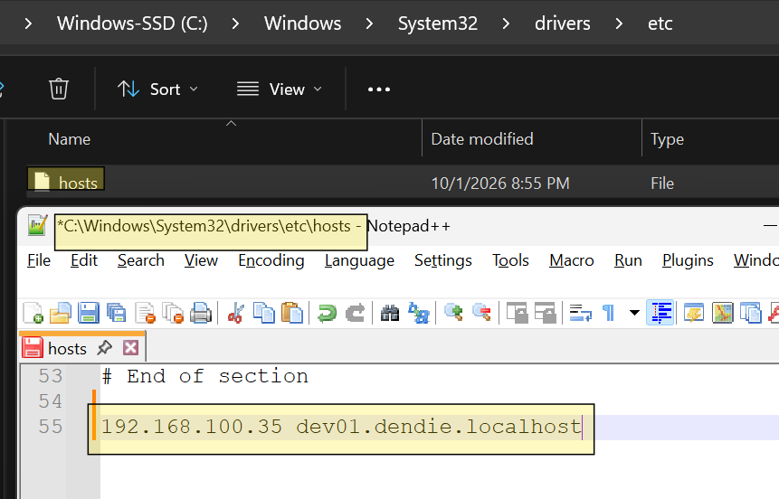

**Pengujian akses domain di browser:**

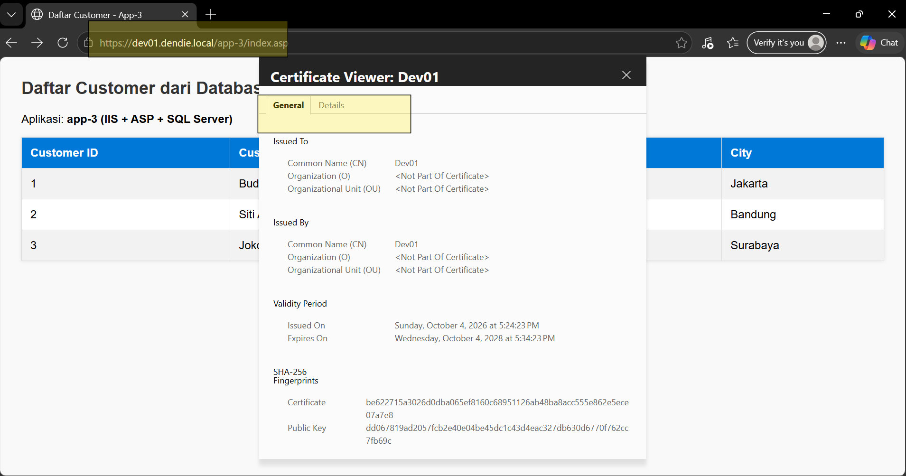

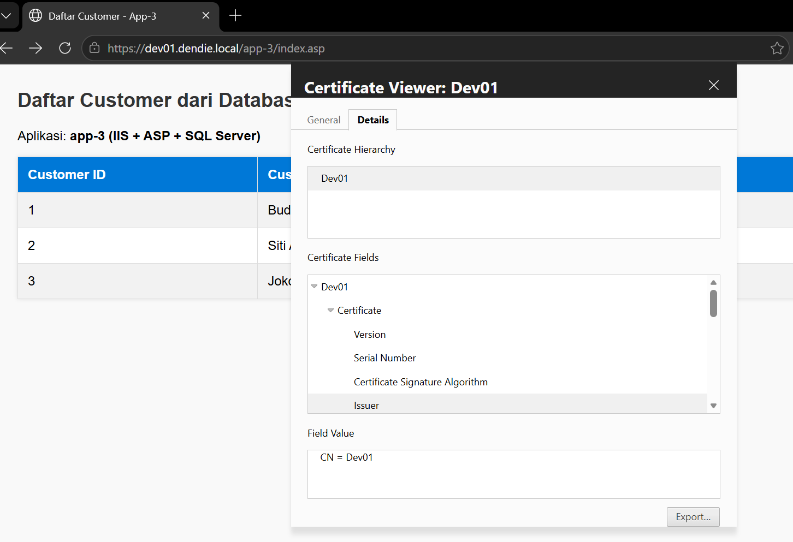

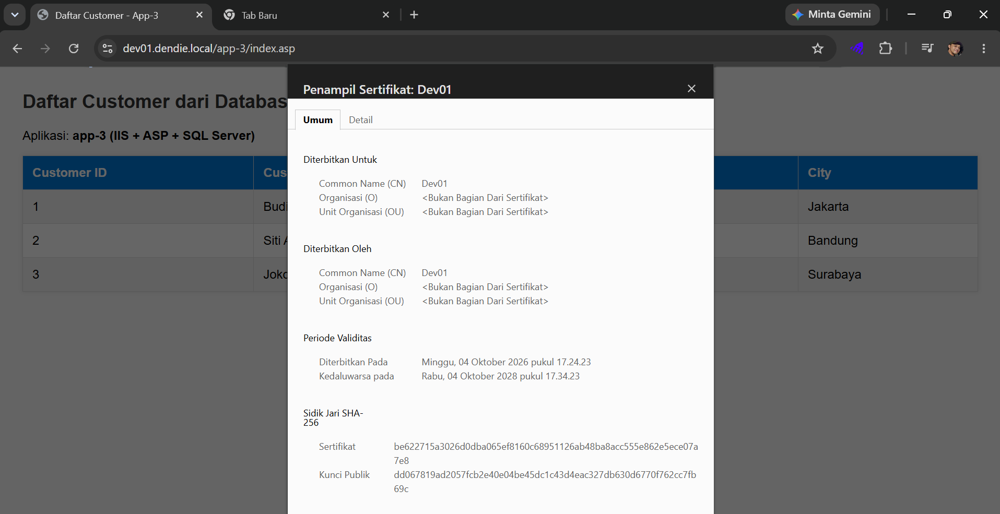

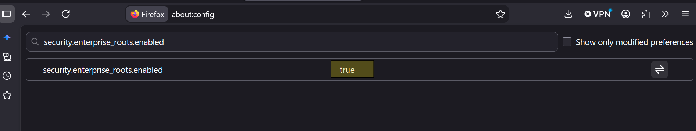

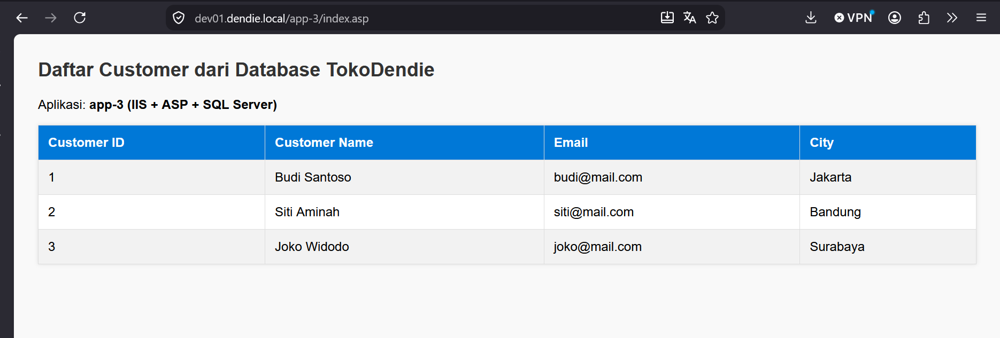

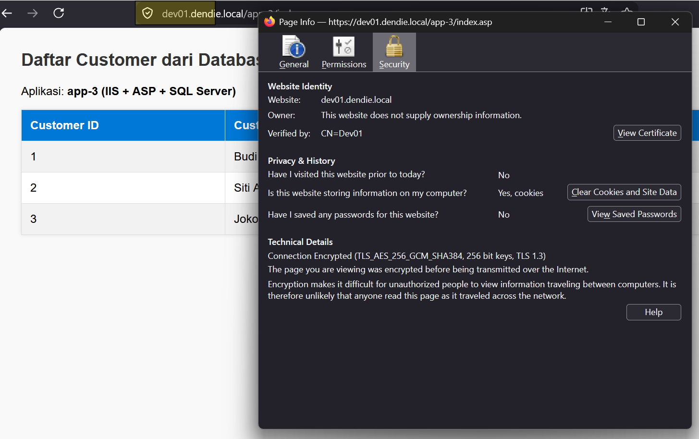


### 6.2 Cara 2: Penjelasan Server DNS Lokal (Jika Menggunakan Infrastruktur Terpusat)
Jika Anda memiliki banyak komputer *client* di dalam satu perusahaan atau jaringan kantor dan tidak ingin repot mengubah file `hosts` satu per satu, Anda harus menggunakan Server DNS Lokal.

* **Menggunakan Apa?**
  * **Windows Server Active Directory (AD DNS):** Standar industri yang paling sering digunakan di lingkungan korporat berbasis Windows. Server Windows akan otomatis mengelola penamaan domain lokal (seperti `.local` atau `.lan`) untuk seluruh komputer yang bergabung ke dalam domain.
  * **DNS Server Alternatif (Ringan/Open Source):** Jika tidak menggunakan Active Directory, Anda bisa menggunakan Pi-hole, BIND9 di Linux, atau fitur DNS server yang ada di router kantor (seperti MikroTik atau pfSense).
* **Fungsi:** Server ini bertugas menerjemahkan nama domain lokal Anda secara otomatis ke jaringan lokal sehingga semua komputer *client* di jaringan yang sama bisa langsung mengakses `dev01.dendie.local` tanpa konfigurasi tambahan di setiap laptop.


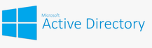

---

### 6.3 Cara 3: Setting Client di Network (Pengaturan DNS Client)
Agar komputer *client* di dalam jaringan bisa mengenali domain lokal melalui server DNS (bukan lewat file `hosts`), Anda harus mengonfigurasi pengaturan jaringan (*Network Adapter*) di komputer *client* tersebut:

1. Buka **Control Panel > Network and Sharing Center > Change adapter settings**.
2. Klik kanan pada jaringan yang digunakan (Wi-Fi atau Ethernet), lalu pilih **Properties**.
3. Pilih **Internet Protocol Version 4 (TCP/IPv4)**, lalu klik **Properties**.
4. Pada bagian pengaturan DNS, pilih **Use the following DNS server addresses**:
   * **Preferred DNS server:** Masukkan alamat IP dari Server DNS lokal Anda (atau IP server Active Directory / IP Router yang sudah dikonfigurasi DNS-nya).
5. Klik **OK**. Dengan pengaturan ini, setiap kali *client* mengetik domain lokal, komputer akan otomatis bertanya ke server DNS tersebut.

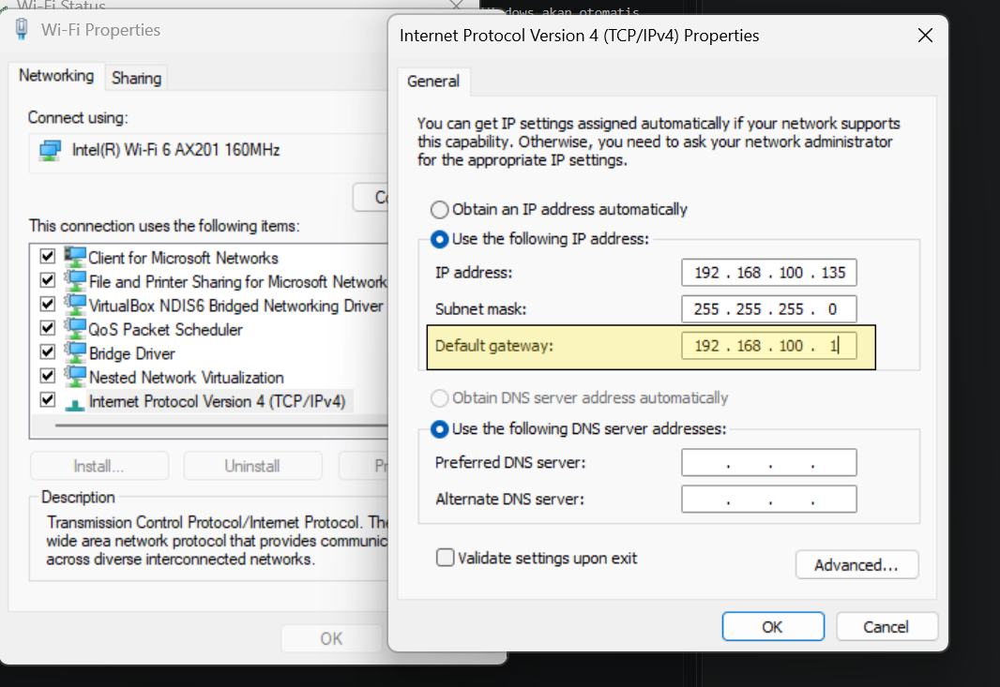

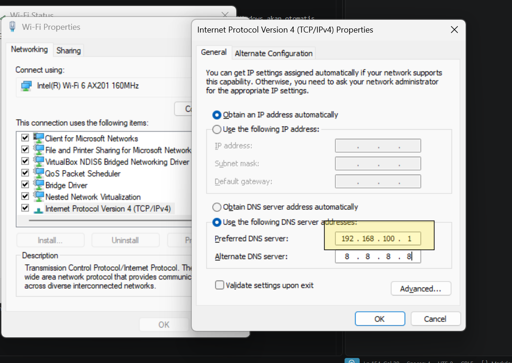

Sebagai contoh server DNS yg berada di IP 192.168.100.1
---

### 6.4 Cara 4: Setting Network di Gateway (Router / Firewall)
Pada sisi *gateway* (seperti router utama, MikroTik, atau *firewall* perusahaan), pengaturan jaringan dilakukan untuk mengatur jalur lalu lintas data (*routing*) dan manajemen IP lokal:

* **DHCP Server & Static Lease:** Di *gateway*, pastikan IP server (misal `192.168.100.35`) diset sebagai *Static/Reserved* agar alamat IP server tidak berubah-ubah saat router direstart.
* **DNS Forwarding / Local DNS Records:** Pada router *gateway* (misalnya MikroTik di menu **IP > DNS > Static**), Anda bisa mendaftarkan catatan DNS lokal secara permanen:
  * **Name:** `dev01.dendie.local`
  * **Address:** `192.168.100.35`
* Dengan mengatur ini di *gateway*, seluruh perangkat yang terhubung ke jaringan Wi-Fi/LAN kantor tersebut akan otomatis bisa langsung membuka `dev01.dendie.local` tanpa perlu *setting* manual lagi di komputer masing-masing.


## 7 Membuat SSL type PFX untuk IIS Certificate

Pastikan saat pertama kali sertifikat *self-signed* dibuat menggunakan PowerShell, parameter `-KeyExportPolicy Exportable` telah disertakan. Tanpa parameter ini, Windows akan mengunci *private key* dan opsi ekspor `.pfx` akan berwarna abu-abu (*disabled*).


### 7.1 Langkah Mengekspor Sertifikat ke Format .PFX (Beserta Private Key)

Jika Anda ingin memindahkan sertifikat ke server IIS lain atau membuat cadangan lengkap, ikuti langkah berikut di server asal:

1. Tekan tombol `Windows + R` pada keyboard, ketik **`certlm.msc`** (Certificates - Local Computer), lalu tekan *Enter*.
2. Pada panel navigasi di sebelah kiri, arahkan ke folder **Personal** > **Certificates**.
3. Cari sertifikat Anda (misalnya berdasarkan *Friendly Name* yang pernah dibuat, contoh: `Web-SSL-Cert`).
4. Klik kanan pada sertifikat tersebut, arahkan ke **All Tasks**, lalu pilih **Export...**.
5. Pada jendela *Certificate Export Wizard*, klik **Next**.
6. Pada bagian **Export Private Key**:
   * Pilih opsi **Yes, export the private key** (Ya, ekspor kunci privat). *(Jika opsi ini terkunci/abu-abu, berarti kunci privat tidak diizinkan untuk diekspor).*
   * Klik **Next**.
7. Pada bagian **Export File Format**:
   * Pilih opsi **Personal Information Exchange - PKCS #12 (.PFX)**.
   * Centang kotak **"Include all certificates in the certification path if possible"** agar rantai sertifikat ikut terbawa.
   * Klik **Next**.
8. Pada bagian **Security**:
   * Beri centang pada opsi **Password**.
   * Masukkan kata sandi (*password*) yang kuat dan konfirmasi password tersebut untuk mengamankan file `.pfx`. Klik **Next**.
9. Pada bagian **File to Export**:
   * Klik *Browse*, tentukan lokasi penyimpanan dan nama file (misal: `C:\Certs\web-server-backup.pfx`), lalu klik **Save** dan **Next**.
10. Klik **Finish**. Pesan sukses akan muncul menandakan file `.pfx` berhasil dibuat.

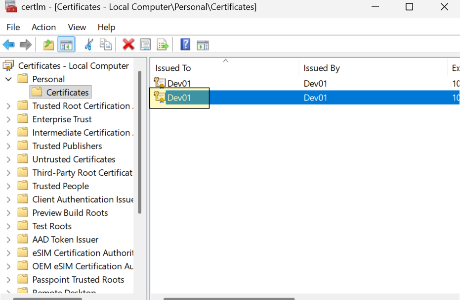

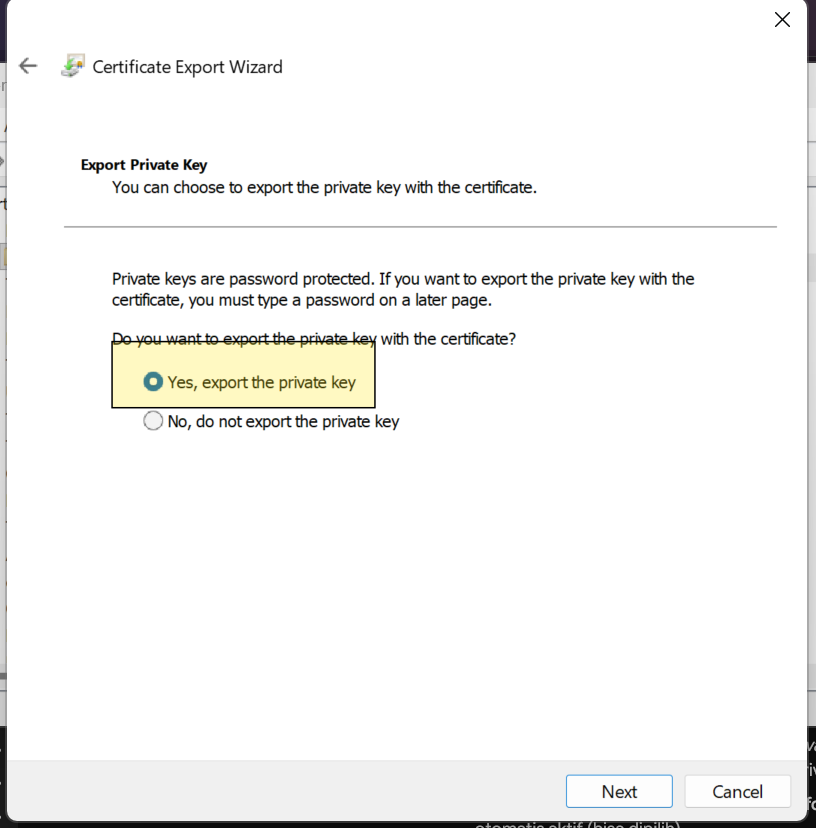

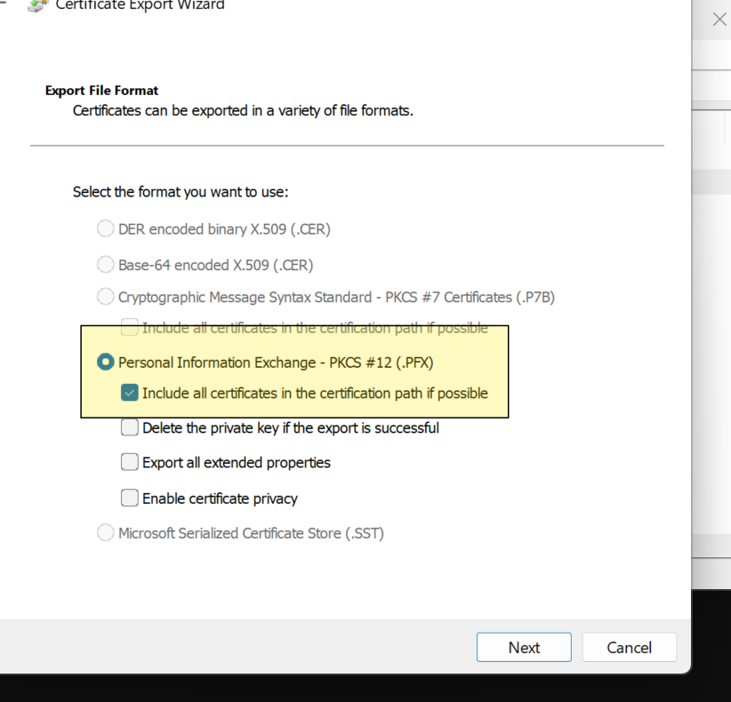

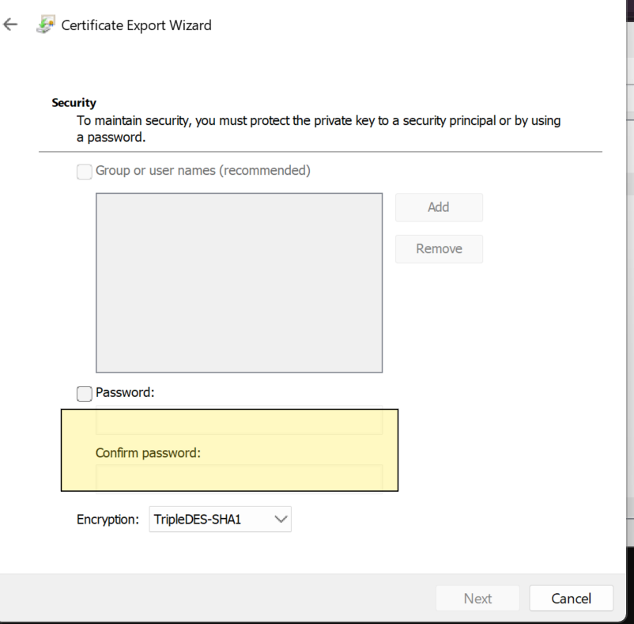

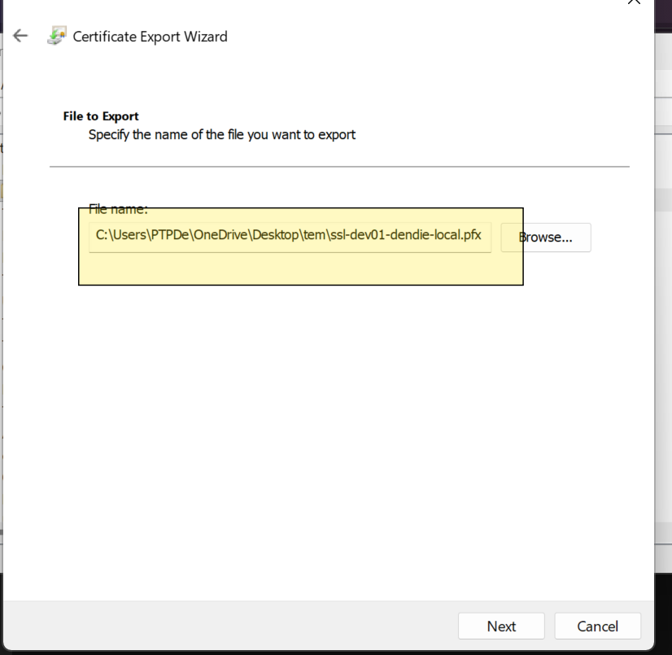

**Import kembali file `.pfx` ke IIS:**

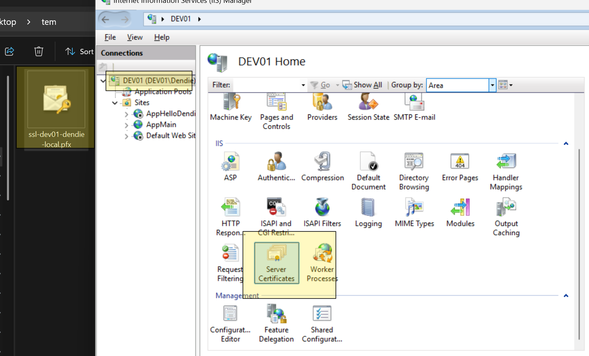

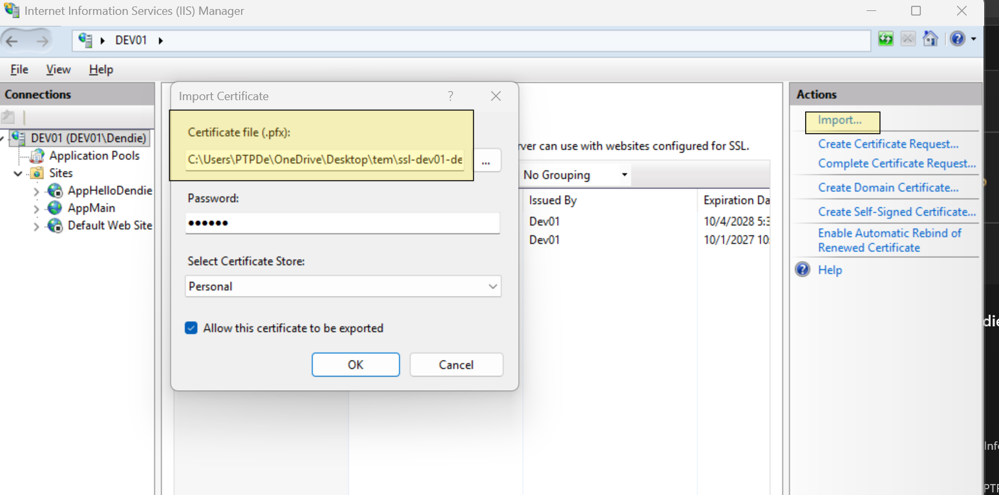

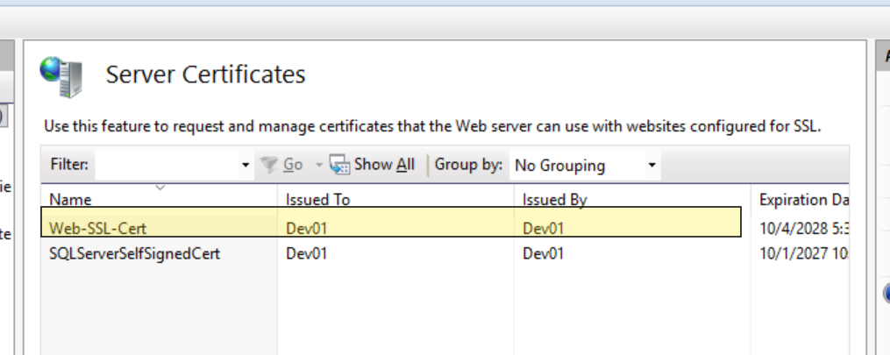